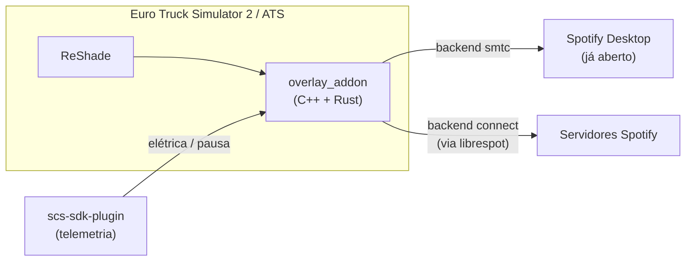

# ets2-spotify-plugin

[](LICENSE)

Addon do [ReShade](https://reshade.me) que controla o Spotify **de dentro do
próprio jogo** no **Euro Truck Simulator 2** / **American Truck Simulator**:
play/pause automático pela elétrica do caminhão, painel com capa/progresso/
volume/playlists, hotkeys globais — compatível com qualquer caminhão, sem
depender de modelo/interior específico.

## Como funciona



Dois backends, escolhidos em `config.json`:

| | `connect` (padrão) | `smtc` |
| --- | --- | --- |
| Precisa do Spotify Desktop aberto | Não — o addon *é* o dispositivo de playback | Sim |
| Login | OAuth (navegador, uma vez) | Nenhum |
| Conta Premium | Obrigatória | Não |
| Como funciona | [librespot](https://github.com/librespot-org/librespot) (reimplementação open source, não-oficial, do protocolo Spotify Connect) | System Media Transport Controls do Windows |

Detalhes de cada backend em [`docs/backends.md`](docs/backends.md).

## Features

- Play/pause automático pela telemetria (elétrica ligada/desligada, jogo
  pausado/despausado).
- Painel no jogo (**F9**): capa do álbum, título/artista, progresso da
  faixa, volume, play/pause/anterior/próxima, playlists salvas.
- Hotkeys globais (funcionam com o painel aberto ou fechado — ver
  [Hotkeys](#hotkeys)).
- Backend `connect` se auto-ativa como dispositivo Spotify Connect ao
  logar — não precisa escolher "ETS2" manualmente em outro aparelho.
- Sem busca por design — ver [por quê](docs/backends.md#por-que-não-tem-busca).

## Instalação

1. Instale o [ReShade](https://reshade.me) no jogo (escolha o `.exe` —
   `eurotrucks2.exe`/`amtrucks.exe` em `bin\win_x64\`, API D3D11).
2. (Opcional, só para play/pause automático) copie a DLL do
   [RenCloud/scs-sdk-plugin](https://github.com/RenCloud/scs-sdk-plugin/releases)
   para `<jogo>\bin\win_x64\plugins\`.
3. Compile: `cd reshade-addon && .\build.bat` (precisa de
   [Rust](https://rustup.rs) + Visual Studio com "Desktop development with
   C++"). Gera `overlay_addon.addon` já no formato certo.
4. Copie `overlay_addon.addon` pra pasta do ReShade no jogo (a mesma do
   `ReShade64.dll`).
5. Abra o jogo. Aperte **Home** uma vez pra confirmar que o addon carregou
   (aba "Add-ons" → "ETS2 x Spotify"). No backend `connect`, o navegador
   abre pra você logar na primeira vez.

## Uso

- **HUD compacto** (sempre visível): capa, título/artista, progresso,
  status.
- **F9**: painel expandido — controles, volume, playlists salvas. Captura
  o teclado enquanto aberto (não mexe no volante/câmera).
- Elétrica do caminhão liga/pausa o Spotify automaticamente.

### Hotkeys

| Ação | Tecla |
| --- | --- |
| Próxima faixa | `Ctrl + PageUp` |
| Faixa anterior | `Ctrl + PageDown` |
| Play | `Ctrl + Insert` |
| Pause | `Ctrl + Delete` |

Pra mudar, edite as constantes `kHotkey*` no topo de
[`reshade-addon/overlay_addon.cpp`](reshade-addon/overlay_addon.cpp) e
recompile.

## Configuração

`%APPDATA%\ets2-spotify-bridge\config.json` — use
[`config.example.json`](config.example.json) como modelo:

```json
{
  "playlists": [
    { "name": "Rock de estrada", "uri": "spotify:playlist:37i9dQZF1DXcBWIGoYBM5M" }
  ],
  "preferred_output_device": null,
  "backend": "connect"
}
```

| Campo | Valores |
| --- | --- |
| `playlists[].uri` | `spotify:playlist:<id>` ou link `open.spotify.com/...` |
| `backend` | `"connect"` (padrão) ou `"smtc"` |
| `preferred_output_device` | Id de saída de áudio (só backend `smtc`), `null` = padrão do Windows |

Editar exige fechar/abrir o jogo (config é lida uma vez, na inicialização).
Sem formulário no painel ainda pra adicionar playlist — é editar o arquivo
à mão mesmo.

## Contribuindo

PRs e issues são bem-vindos. Pontos de entrada úteis:

- **`src/`** — staticlib Rust com toda a lógica (linkada dentro do addon).
  `engine.rs` é a thread única que fala com telemetria/SMTC; `spotify_connect.rs`
  é o backend Connect (roda numa thread própria com seu runtime async);
  `ffi.rs` é a fronteira `extern "C"` com o C++.
- **`reshade-addon/`** — addon C++/ImGui. Só cuida de UI e do que só o
  ReShade expõe; toda integração real vive na staticlib acima.
- **Build de desenvolvimento**: `cargo check` na raiz valida só o lado
  Rust (mais rápido, não precisa do MSVC/VS instalado). `reshade-addon\build.bat`
  builda tudo (Rust + C++ + link).
- O código é bem comentado explicando o *porquê* das decisões não-óbvias
  (workarounds de API, limitações do SMTC/Connect etc.) — mantenha esse
  padrão em contribuições.
- Sem CI/testes automatizados ainda; teste manualmente no jogo antes de
  abrir PR.

## Licença

[MIT](LICENSE)
